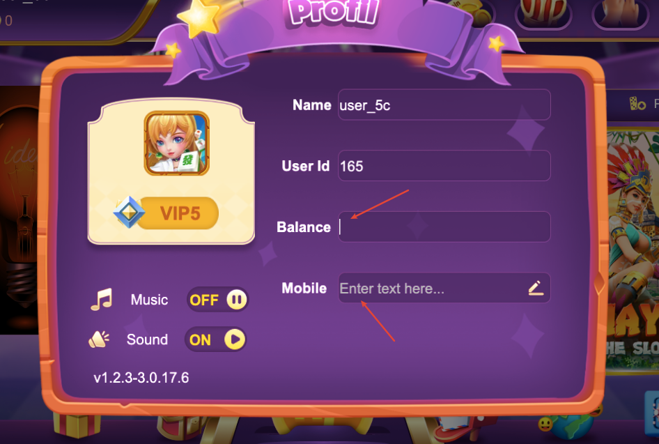
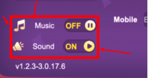
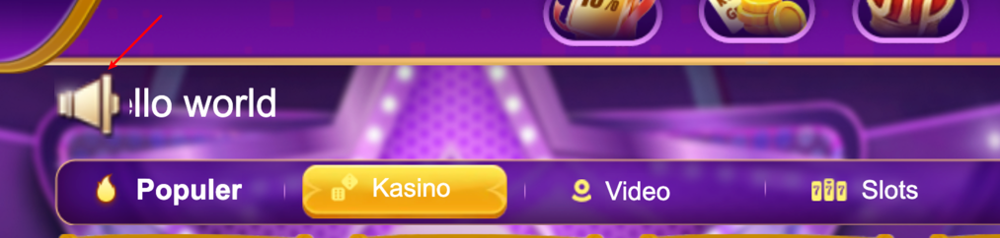
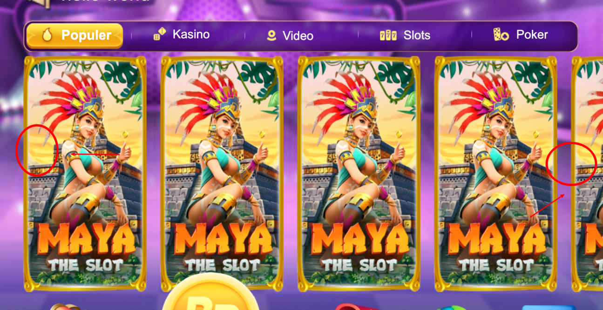
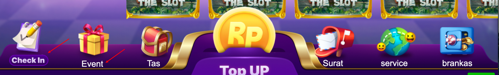
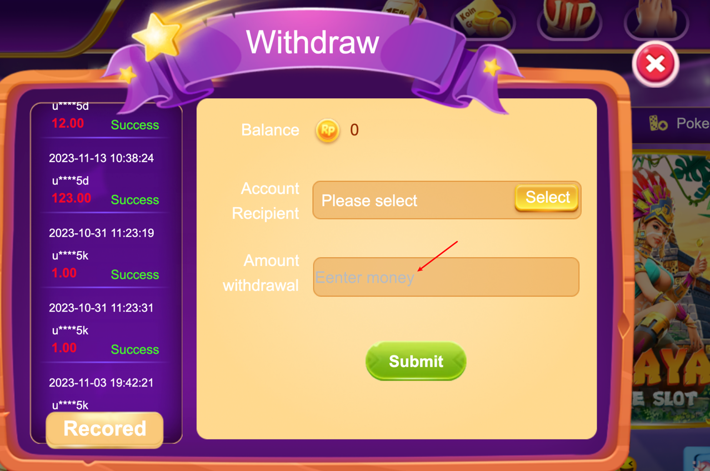
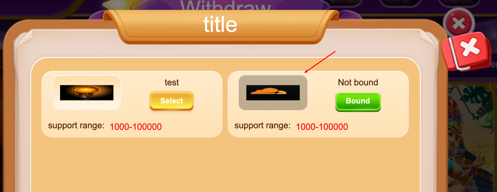
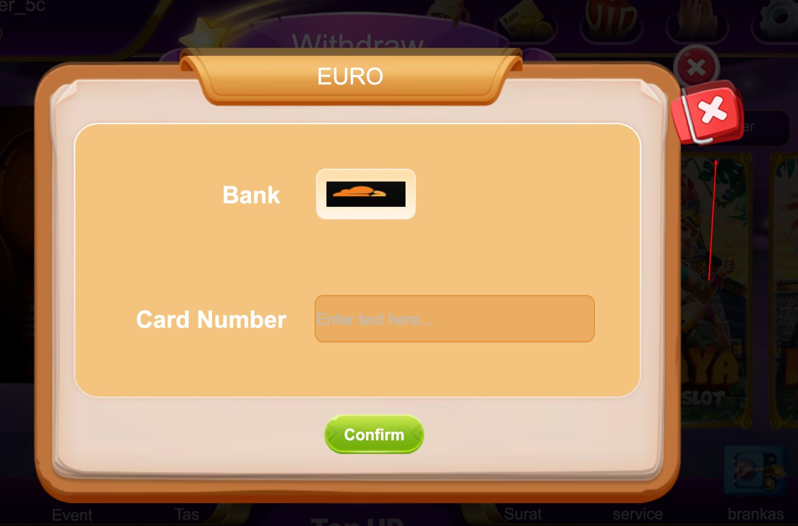
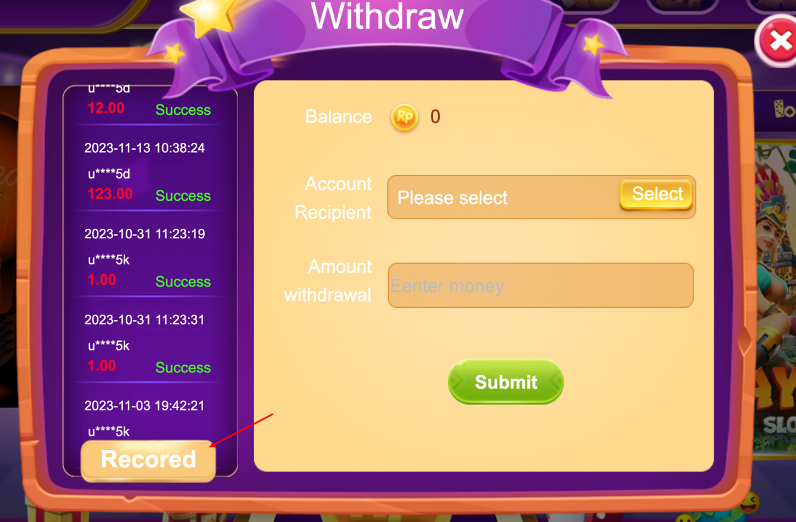

# 1. 设置

## 1.1. 音乐、音效开关

## 1.2 个人信息

 输入框 padding:设置为5px

参考 

- 添加一个退出按钮
- 这里input不能进行输入修改
- ID 添加复制图标
- Name 添加复制图标
- Name 展示 Nickname,可以修改 nickname

## 1.3 加点修饰

## 1.4 对齐

## 1.5 vip 用户注册后为 vip0

# 2. 效果

## 2.1 弹框效果

弹框效果 放大后不要再小范围的收缩，会有一种冲击感，让人感受到不舒服。

## 2.2 添加点击音效

# 3. 视觉

## 3.1 通知图标粗糙

## 3.2 多游戏切换按钮

参考

## 3.3

文字 风格保持一致

# 4. 帮助页面

点击后展示帮助页面，内容 anti 找账户注册进去看看

# 5. vip页面

点击后 暂时 vip 介绍

参考

# 6. 提现

图标写清楚， 带有 提现的图标，不然不知道这是干嘛的

## 6.1 提现文字色彩 不统一，没有padding

输入框 padding: 统一 5px

## 6.2 绑定 提现银行图片 比例不对

## 6.3 点击关闭是 关闭当前，而不是关闭所有

## 6.4 提现记录

### 6.41 单词不对

record

### 6.42 提现按钮放在 submit 旁边

### 6.43 提现弹框出现后，关闭也只关闭当前就好，不要全部都关闭

# 7 用户信息

## 7.1 点击则打开用户信息

## 7.2 显示用户nickname

这是可以修改的
